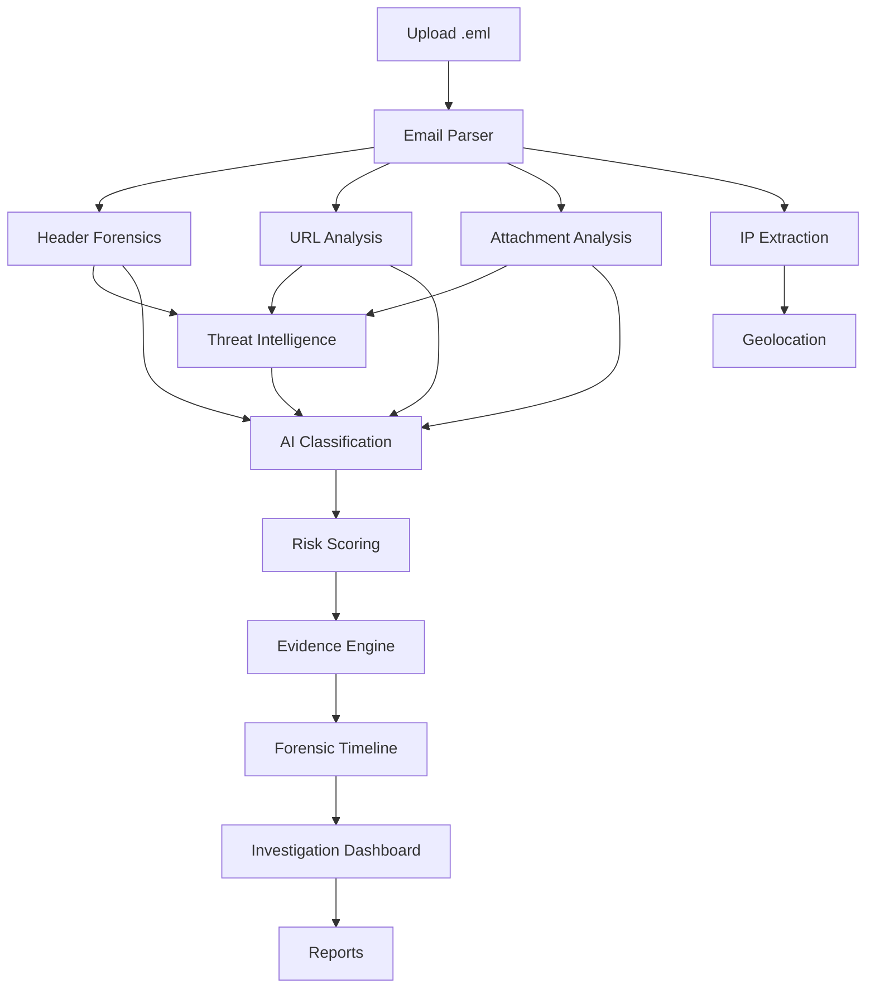

# AI Email Intelligence — SIH26106

## AI-Powered Email Threat Detection, GeoLocation and Forensic Intelligence Platform

A production-quality Streamlit application that accepts suspicious `.eml` email files, analyzes them for threats using AI/ML, extracts infrastructure intelligence, performs geolocation, conducts digital forensics, calculates an explainable risk score, generates a forensic timeline, and produces downloadable investigation reports.

Built for **Smart India Hackathon 2026 — Problem Statement SIH26106**.

---

## Problem Overview

Email remains the primary vector for cyberattacks — phishing, malware delivery, social engineering, and business email compromise. Security analysts need tools that can rapidly triage suspicious emails, identify the infrastructure behind them, and produce evidence-grade reports.

**AI Email Intelligence** addresses this by providing an end-to-end forensic analysis pipeline in a single, deployable application.

---

## Solution

A unified Streamlit platform that:

1. **Parses** `.eml` files (headers, body, HTML, URLs, attachments)
2. **Analyzes** email authentication (SPF, DKIM, DMARC) and header forensics
3. **Extracts** and classifies URLs, IPs, and domains
4. **Queries** threat intelligence APIs (VirusTotal, AbuseIPDB) with local fallback
5. **Geolocates** source IPs with API + offline support
6. **Classifies** threats using a hybrid AI pipeline (TF-IDF + heuristic)
7. **Scores** risk on an explainable 0–100 scale
8. **Generates** evidence, forensic timeline, and downloadable reports

---

## Architecture



### Project Structure

```
sih26106-email-forensics/
├── app.py                      # Main Streamlit entry point
├── requirements.txt
├── runtime.txt
├── .env.example
├── .streamlit/config.toml
├── pages/                      # Multi-page Streamlit app
│   ├── 1_📊_Dashboard.py
│   ├── 2_📧_Email_Analysis.py
│   ├── 3_🌐_Threat_Intelligence.py
│   ├── 4_🔬_Digital_Forensics.py
│   └── 5_📄_Reports.py
├── analyzers/                  # Email parsing & analysis
│   ├── email_parser.py
│   ├── header_analyzer.py
│   ├── url_analyzer.py
│   ├── attachment_analyzer.py
│   ├── ip_analyzer.py
│   └── domain_analyzer.py
├── ai/                         # AI/ML pipeline
│   ├── features.py
│   ├── classifier.py
│   ├── model_manager.py
│   └── risk_score.py
├── intelligence/               # Threat intel & geolocation
│   ├── geolocation.py
│   ├── reputation.py
│   └── threat_intel.py
├── forensics/                  # Evidence, timeline, reports
│   ├── evidence.py
│   ├── timeline.py
│   └── report_generator.py
├── utils/                      # Shared utilities
│   ├── constants.py
│   ├── helpers.py
│   └── session.py
├── sample_emails/              # Demo .eml files
│   ├── benign.eml
│   ├── phishing.eml
│   └── suspicious.eml
└── tests/                      # pytest test suite
    ├── test_email_parser.py
    ├── test_header_analyzer.py
    ├── test_url_analyzer.py
    ├── test_attachment_analyzer.py
    ├── test_ip_analyzer.py
    ├── test_risk_score.py
    ├── test_forensics.py
    ├── test_ai_classifier.py
    └── test_integration.py
```

---

## Features

- **Email Parsing**: Robust `.eml` parser with multipart support, graceful error handling
- **Header Forensics**: SPF/DKIM/DMARC validation, spoofing detection, routing analysis
- **URL Analysis**: Passive analysis — never visits URLs; detects phishing keywords, IP URLs, shorteners, suspicious TLDs
- **Attachment Forensics**: SHA-256/MD5 hashing, dangerous extension detection, double-extension detection
- **IP Extraction & Classification**: Private/public/loopback/reserved classification
- **Geolocation**: IP geolocation via IPInfo API with offline fallback
- **Threat Intelligence**: VirusTotal (IP, domain, URL, hash) + AbuseIPDB integration with local heuristic fallback
- **AI Threat Detection**: Hybrid TF-IDF + heuristic classifier with explainable predictions
- **Risk Scoring**: Weighted 0–100 score (AI 40% · Headers 20% · URLs 15% · Threat Intel 15% · Attachments 10%)
- **Evidence Engine**: Structured evidence items with unique IDs, severity, and descriptions
- **Forensic Timeline**: Chronological investigation timeline with timestamps
- **Reports**: JSON, CSV, and HTML forensic reports with disclaimers
- **Demo Mode**: Load synthetic sample emails (benign, phishing, suspicious) without API keys
- **Offline Mode**: Full functionality without internet or API keys

---

## Technology Stack

| Component | Technology |
|-----------|-----------|
| Framework | Streamlit |
| Language | Python 3.11 |
| ML | scikit-learn (TF-IDF + Logistic Regression) |
| Visualization | Plotly |
| Email Parsing | Python `email` standard library |
| HTML Parsing | BeautifulSoup4 |
| DNS | dnspython |
| HTTP | requests |
| Testing | pytest |

---

## Installation

### Prerequisites

- Python 3.11 or 3.12 installed on your machine
- Git installed on your machine
- (Optional) API keys for VirusTotal, AbuseIPDB, or IPInfo — the app works without them

### Step-by-step Installation

**1. Clone the repository**

```bash
git clone https://github.com/YOUR_USERNAME/ai-email-intelligence.git
cd ai-email-intelligence
```

**2. Create a virtual environment (recommended)**

On **Linux / macOS**:
```bash
python3 -m venv venv
source venv/bin/activate
```

On **Windows**:
```powershell
python -m venv venv
venv\Scripts\activate
```

**3. Install dependencies**

```bash
pip install -r requirements.txt
```

This installs Streamlit, scikit-learn, Plotly, pandas, BeautifulSoup4, tldextract, dnspython, and all other required packages.

**4. (Optional) Configure API keys**

Copy the example environment file and add your API keys:

```bash
cp .env.example .env
```

Then edit `.env` and fill in any keys you have:

```env
VIRUSTOTAL_API_KEY=your_key_here
ABUSEIPDB_API_KEY=your_key_here
IPINFO_TOKEN=your_key_here
```

> **Note:** All three keys are optional. Without them, the app runs in LOCAL ANALYSIS mode with heuristic fallbacks. With them, it runs in FULL INTELLIGENCE mode.

**5. Verify the installation**

Run the test suite to confirm everything is working:

```bash
pytest -q
```

You should see all 66 tests pass.

---

## Environment Variables

All API keys are **optional**. The application works fully without them in LOCAL ANALYSIS mode.

Copy `.env.example` to `.env` and fill in keys if available:

```env
VIRUSTOTAL_API_KEY=
ABUSEIPDB_API_KEY=
IPINFO_TOKEN=
```

On Streamlit Cloud, add the same keys under **Settings → Secrets**.

| Variable | Purpose | Required |
|----------|---------|----------|
| `VIRUSTOTAL_API_KEY` | VirusTotal API (IP, domain, URL, hash reputation) | No |
| `ABUSEIPDB_API_KEY` | AbuseIPDB IP reputation | No |
| `IPINFO_TOKEN` | IPInfo geolocation API | No |

---

## Running Locally

**1. Start the Streamlit server**

```bash
streamlit run app.py
```

**2. Open your browser**

The app automatically opens at `http://localhost:8501`. If it does not, navigate there manually.

**3. Upload an email or load a demo**

- Click **Upload suspicious email** to upload a `.eml` or `.txt` file
- Or click **Benign**, **Phishing**, or **Suspicious** under Demo Investigation to load a sample email

**4. Explore the results**

Use the sidebar to navigate between pages:
- **Dashboard** — metrics, risk gauge, charts
- **Email Analysis** — headers, URLs, attachments, IPs
- **Threat Intelligence** — reputation results, geolocation, manual lookup
- **Digital Forensics** — evidence, timeline, attack chain, infrastructure map
- **Reports** — download JSON, CSV, HTML reports

**5. (Optional) Stop the server**

Press `Ctrl+C` in the terminal to stop the Streamlit server.

---

## Running Tests

The project includes a comprehensive pytest test suite covering all modules:

```bash
pytest -q
```

To run a specific test file:

```bash
pytest tests/test_email_parser.py -q
pytest tests/test_header_analyzer.py -q
pytest tests/test_integration.py -q
```

To run tests with verbose output:

```bash
pytest -v
```

---

## Pushing to GitHub

Follow these steps to push the project to your GitHub repository:

**1. Create a new GitHub repository**

- Go to [github.com/new](https://github.com/new)
- Name it `ai-email-intelligence` (or any name you prefer)
- Set it to **Public** (required for free Streamlit Cloud deployment)
- Do **not** initialize with a README, .gitignore, or license (these already exist in the project)
- Click **Create repository**

**2. Initialize Git in your project folder**

```bash
cd ai-email-intelligence
git init
```

**3. Add all files and make your first commit**

```bash
git add .
git commit -m "Initial commit: AI Email Intelligence - SIH26106"
```

**4. Set the branch name to main**

```bash
git branch -M main
```

**5. Link to your GitHub repository**

```bash
git remote add origin https://github.com/YOUR_USERNAME/ai-email-intelligence.git
```

Replace `YOUR_USERNAME` with your actual GitHub username.

**6. Push to GitHub**

```bash
git push -u origin main
```

If prompted, enter your GitHub username and personal access token (not your password). To create a token, go to **GitHub Settings → Developer settings → Personal access tokens → Generate new token**.

**7. Verify the push**

Go to your repository on GitHub (`https://github.com/YOUR_USERNAME/ai-email-intelligence`) and confirm all files are visible.

---

## Streamlit Cloud Deployment

After pushing to GitHub, deploy to Streamlit Community Cloud for free:

**1. Go to Streamlit Cloud**

Visit [share.streamlit.io](https://share.streamlit.io) and sign in with your GitHub account.

**2. Create a new app**

- Click **New app**
- Select your repository: `YOUR_USERNAME/ai-email-intelligence`
- Set the branch to `main`
- Set the main file path to `app.py`

**3. (Optional) Add secrets**

- Click **Settings → Secrets**
- Add your API keys in TOML format:

```toml
VIRUSTOTAL_API_KEY = "your_key_here"
ABUSEIPDB_API_KEY = "your_key_here"
IPINFO_TOKEN = "your_key_here"
```

- These are optional — the app works without them in LOCAL ANALYSIS mode.

**4. Deploy**

- Click **Deploy**
- Wait 2-5 minutes for the build to complete
- Your app will be live at `https://YOUR_USERNAME-ai-email-intelligence.streamlit.app`

**5. Updating the app**

Any time you push changes to GitHub:
```bash
git add .
git commit -m "Description of changes"
git push
```

Streamlit Cloud will automatically detect the push and redeploy.

The `runtime.txt` file specifies Python 3.11. The `.streamlit/config.toml` sets the dark theme and upload limits.

---

## Demo Instructions

1. Open the application
2. Click one of the **Demo Investigation** buttons:
   - **Benign** — a normal legitimate email
   - **Phishing** — a synthetic phishing email with SPF/DMARC failures, fake login URL, urgency language
   - **Suspicious** — a complex email with suspicious routing, dangerous attachment, mismatched Reply-To
3. The full analysis pipeline runs automatically
4. Navigate through the pages to see results:
   - **Dashboard** — metrics, risk gauge, charts
   - **Email Analysis** — headers, URLs, attachments, IPs
   - **Threat Intelligence** — reputation results, geolocation, manual lookup
   - **Digital Forensics** — evidence, timeline, attack chain, infrastructure map
   - **Reports** — download JSON, CSV, HTML reports

---

## Security Considerations

- **Never executes** uploaded attachments or macros
- **Never visits** suspicious URLs automatically — all URL analysis is passive
- **Never runs** shell commands from email content
- Filenames are sanitized to prevent path traversal
- Upload size limited to 10 MB
- API keys read from environment/Streamlit secrets — never committed
- `.env` is in `.gitignore`
- External API calls use timeouts to prevent hangs
- Malformed emails are handled gracefully — the app never crashes

---

## API Integrations

### VirusTotal
- **IP reputation**: queries VT v3 API for IP analysis stats
- **Domain reputation**: queries VT v3 API for domain analysis stats
- **URL reputation**: queries VT v3 API using URL ID encoding
- **File hash reputation**: queries VT v3 API for file hash analysis stats

### AbuseIPDB
- **IP reputation**: queries AbuseIPDB v2 API for abuse confidence score

### IPInfo
- **Geolocation**: queries ipinfo.io for country, region, city, ASN, organization

All integrations gracefully degrade to local heuristics when API keys are missing or requests fail.

---

## Limitations

- Geolocation represents **observed network infrastructure**, not the attacker's physical location
- AI classification uses a heuristic fallback when no trained model is available (displayed as "Heuristic fallback")
- URL analysis is passive — no active URL scanning or sandboxing
- Attachment analysis is metadata-only — no sandbox execution
- External API rate limits may apply

---

## Future Enhancements

- Trained ML model with labeled phishing datasets
- Active URL scanning via sandbox integration
- DMARC report aggregation
- Real-time email feed monitoring
- Integration with SIEM platforms
- Automated IOC extraction and sharing via STIX/TAXII
- PDF report generation
- Multi-language support
- User authentication and investigation history

---

## Disclaimer

This application performs automated forensic analysis. Results should be validated by a qualified security analyst before being used as definitive attribution.
